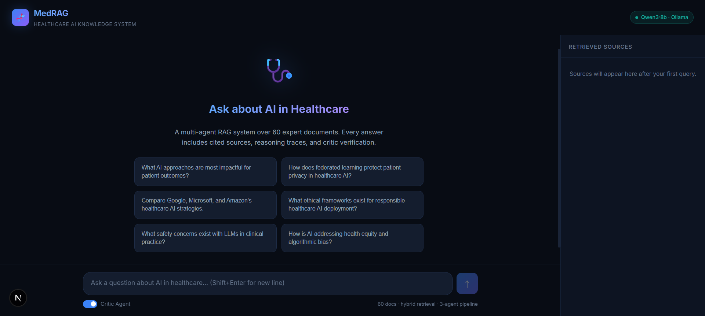
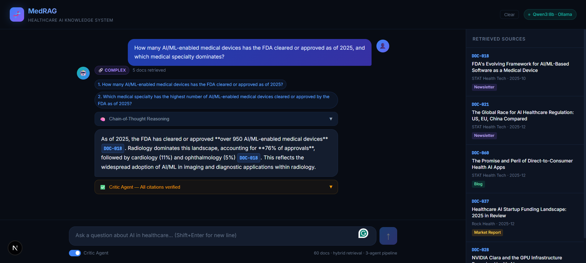
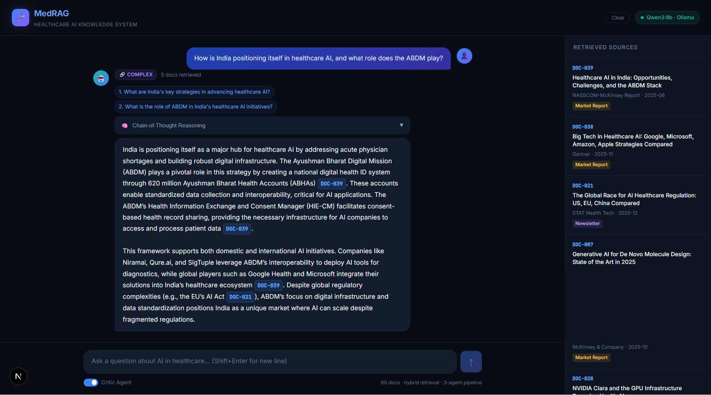
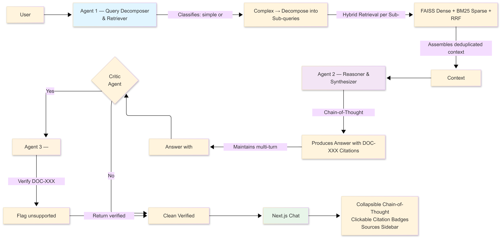

# MedRAG — Agentic RAG for AI in Healthcare

> Multi-agent Retrieval-Augmented Generation over a 60-document AI-in-Healthcare knowledge base.

---

## What is MedRAG?

MedRAG is a fully local, agentic RAG system that lets anyone ask natural-language questions about AI in Healthcare and receive **cited, reasoned answers** grounded in a curated set of 60 expert documents (research papers, market reports, blogs, newsletters). Every response is produced by a 3-agent pipeline — a Decomposer, a Reasoner, and a Critic — and every factual claim is linked to the exact source document that supports it.

---

## Screenshots

### Landing Page


The home screen offers six pre-built suggestion cards to get started instantly. The status badge (top-right) shows which LLM is active. The **Retrieved Sources** sidebar on the right populates after each query.

---

### Complex Query — Sub-query Decomposition + Citations


For multi-part questions, Agent 1 automatically decomposes the query into sub-queries (shown as numbered blue chips). The answer body contains **inline [DOC-XXX] badges** — clickable chips that open a document detail popup. The green **Critic Agent — All citations verified** bar confirms Agent 3 checked every claim.

---

### Multi-document Synthesis — Cross-corpus Answer


For questions that span multiple documents, the system retrieves and synthesises across sources. The sidebar lists every document consulted, with its title, publisher, date, and a colour-coded type badge (Market Report, Newsletter, Blog, Research Paper). Citations inside the answer body (`[DOC-039]`, `[DOC-021]`) map directly to the sidebar entries.

---

## Architecture



```
User Query
    │
    ▼
┌─────────────────────────────────────────────┐
│  Agent 1 — Query Decomposer & Retriever     │
│  • Classifies query: simple or complex      │
│  • Complex → decomposes into sub-queries    │
│  • Hybrid retrieve per sub-query:           │
│    FAISS (dense) + BM25 (sparse) + RRF      │
│  • Assembles deduplicated context package   │
└───────────────────┬─────────────────────────┘
                    │
                    ▼
┌─────────────────────────────────────────────┐
│  Agent 2 — Reasoner & Synthesizer           │
│  • Explicit chain-of-thought over context   │
│  • Produces answer with [DOC-XXX] citations │
│  • Maintains multi-turn conversation memory │
└───────────────────┬─────────────────────────┘
                    │
                    ▼
┌─────────────────────────────────────────────┐
│  Agent 3 — Critic  (toggleable)             │
│  • Verifies every [DOC-XXX] citation        │
│  • Flags unsupported / hallucinated claims  │
│  • Returns a verified, clean answer         │
└───────────────────┬─────────────────────────┘
                    │
                    ▼
┌─────────────────────────────────────────────┐
│  Next.js Chat UI                            │
│  • Collapsible Chain-of-Thought panel       │
│  • Clickable inline citation badges         │
│  • Retrieved Sources sidebar                │
│  • Multi-turn conversation context          │
└─────────────────────────────────────────────┘
```

---

## Tech Stack

| Layer | Technology |
|---|---|
| LLM | Qwen3:8b via [Ollama](https://ollama.com/) (fully local) |
| Embeddings | `all-MiniLM-L6-v2` — SentenceTransformers |
| Vector Store | FAISS (IndexFlatIP — cosine via normalised vectors) |
| Sparse Retrieval | BM25 (`rank-bm25`) |
| Retrieval Fusion | Reciprocal Rank Fusion (RRF) |
| Backend | Python · FastAPI · Uvicorn |
| Frontend | Next.js 16 · Vanilla CSS (no Tailwind) |
| Eval | Python · embedding cosine sim · citation matching |

---

## Some Extra Features

| Feature | Details |
|---|---|
| **Critic Agent** | Agent 3 verifies citations before surfacing answers |
| **Query Routing** | LLM classifier routes simple queries to 1-hop, complex to multi-hop |
| **Eval Automation** | `eval/run_eval.py` scores all 20 questions automatically |
| **Hybrid Retrieval** | FAISS dense + BM25 sparse fused with RRF |

---

## Setup

### Prerequisites
- Python 3.11+
- Node.js 18+
- [Ollama](https://ollama.com/) installed and running locally
- Qwen3:8b pulled: `ollama pull qwen3:8b`

### 1 — Backend

```bash
cd backend
pip install -r requirements.txt

# Build the FAISS + BM25 index (run once)
python indexer.py

# Start the API server
python -m uvicorn main:app --reload --port 8000
```

### 2 — Frontend

```bash
cd frontend

# Create frontend/.env.local containing:
# NEXT_PUBLIC_API_URL=http://localhost:8000

npm install
npm run dev
```

Open **http://localhost:3000**

### 3 — Run Automated Evaluation

```bash
# Backend must be running on port 8000
cd eval
python run_eval.py
# Scores saved to eval/eval_results.json
```

---

## File Structure

```
medrag/
├── README.md                            ← this file
├── DETAILS.md                           ← in-depth technical writeup
├── knowledge_base_ai_healthcare.json    ← 60 source documents
├── eval_set_ai_healthcare.json          ← 20 evaluation questions
├── screenshots/
│   ├── main-page.png
│   ├── question1.png
│   └── question2.png
├── backend/
│   ├── indexer.py        ← chunk, embed, build FAISS + BM25
│   ├── retriever.py      ← hybrid dense+sparse retrieval with RRF
│   ├── agents.py         ← 3-agent pipeline (Qwen3:8b via Ollama)
│   ├── main.py           ← FastAPI server (/chat, /health, /index)
│   ├── requirements.txt
│   └── index/            ← generated at indexing time
│       ├── faiss.index
│       ├── chunks.pkl
│       ├── bm25.pkl
│       └── tokenized.pkl
├── eval/
│   ├── run_eval.py       ← automated scoring script
│   └── eval_results.json ← generated after running eval
└── frontend/
    ├── .env.local         ← NEXT_PUBLIC_API_URL=http://localhost:8000
    ├── next.config.ts
    ├── package.json
    └── app/
        ├── page.tsx               ← main chat page
        ├── globals.css            ← full vanilla CSS design system
        ├── layout.tsx             ← Next.js root layout + SEO metadata
        ├── types.ts               ← shared TypeScript interfaces
        └── components/
            ├── ReasoningPanel.tsx ← collapsible CoT accordion
            ├── CriticPanel.tsx    ← critic verification output
            ├── FinalAnswer.tsx    ← inline [DOC-XXX] citation rendering
            ├── SourceCard.tsx     ← sidebar document card
            └── DocModal.tsx       ← document detail popup
```

---

> For a full deep-dive into how each component works, see [DETAILS.md](DETAILS.md).
